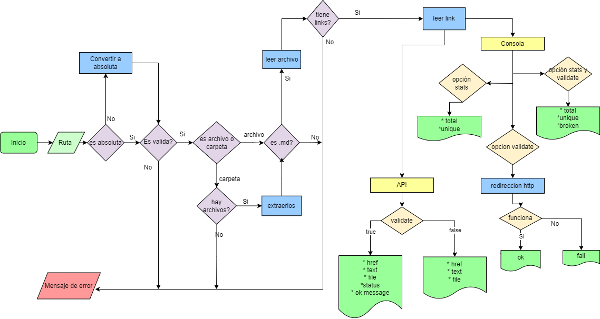

# Markdown Links

## Índice

* [1. Diagrama de Flujo](#1-diagrama-de-flujo)
* [2. Instalación](#2-resumen-del-proyecto)
* [3. Uso](#3-objetivos-de-aprendizaje)
* [4. Comandos](#4-comandos)
* [5. Dependencias](#5-dependencias)

***

## 1. Diagrama de Flujo



## 2. Instalación

Para su instalación se debe ejecutar
#### `npm install md-links-y`

## 3. Uso

### API

La librería se debe importar de la siguiente manera:

#### `const mdLinks = require("md-links-y");`

La función retorna una promesa (Promise) que resuelva a un arreglo (Array) de objetos (Object), donde cada objeto representa un link y contiene las siguientes propiedades:

Con `validate:false` :

* `href`: URL encontrada.
* `text`: Texto que aparecía dentro del link (`<a>`).
* `file`: Ruta del archivo donde se encontró el link.

Con `validate:true` :

* `href`: URL encontrada.
* `text`: Texto que aparecía dentro del link (`<a>`).
* `file`: Ruta del archivo donde se encontró el link.
* `status`: Código de respuesta HTTP.
* `statusText`: Mensaje `fail` en caso de fallo u `OK` en caso de éxito.

#### Ejemplo (resultados como comentarios)

```js
const mdLinks = require("md-links");

mdLinks("./some/example.md")
  .then(links => {
    // => [{ href, text, file }, ...]
  })
  .catch(console.error);

mdLinks("./some/example.md", { validate: true })
  .then(links => {
    // => [{ href, text, file, status, ok }, ...]
  })
  .catch(console.error);

mdLinks("./some/dir")
  .then(links => {
    // => [{ href, text, file }, ...]
  })
  .catch(console.error);
```

### CLI (Command Line Interface - Interfaz de Línea de Comando)

Puede ejecutarse de la siguiente
manera a través de la **terminal**:

#### `md-links <path-to-file> [options]`

Por ejemplo:

```sh
$ md-links ./some/example.md
./some/example.md http://algo.com/2/3/ Link a algo
./some/example.md https://otra-cosa.net/algun-doc.html algún doc
./some/example.md http://google.com/ Google
```

#### Options

##### `--validate`

Si pasamos la opción `--validate` o `-v`, el módulo hacer una petición HTTP para
averiguar si el link funciona o no.

Por ejemplo:

```sh
$ md-links ./some/example.md --validate
./some/example.md http://algo.com/2/3/ ok 200 Link a algo
./some/example.md https://otra-cosa.net/algun-doc.html fail 404 algún doc
./some/example.md http://google.com/ ok 301 Google
```

##### `--stats`

Si pasamos la opción `--stats` o `-s` el output (salida) será un texto con estadísticas
básicas sobre los links.

```sh
$ md-links ./some/example.md --stats
Total: 3
Unique: 3
```

##### `--stats` y `--validate`

También podemos combinar `--stats` y `--validate` para obtener estadísticas que
necesiten de los resultados de la validación.

```sh
$ md-links ./some/example.md --stats --validate
Total: 3
Unique: 3
Broken: 1
```

## 4. Comandos

```js
+--------------------+---------------------------------------------------------+
|      Comandos       |                       Descripción                      |
+--------------------+---------------------------------------------------------+
|  md-links ruta      | Muestra la ruta, enlace y el texto                     |
+---------------------+--------------------------------------------------------+
| --stats  -s  --s    | Muestra el los links totales y unicos                  |
+--------------------+---------------------------------------------------------+
| --validate  -v  --v | Muestra la ruta, el texto, enlace, status y el mensaje |
+--------------------+--------------------------------------------------------+
| --validate --stats  | Muestra los enlaces totales, unicos y rotos            |
| --stats --validate  |                                                        |
| -s -v, -v -s        |                                                        |
+---------------------+--------------------------------------------------------+
| --help    -h        | Muestra los comandos                                   |
+--------------------+---------------------------------------------------------+
```

## 5. Dependencias

- [File system](https://nodejs.org/api/fs.html)
- [Path](https://nodejs.dev/learn/nodejs-file-paths)
- [Axios](https://www.npmjs.com/package/axios)
- [Yargs](https://www.npmjs.com/package/yargs)
- [Chalk](https://www.npmjs.com/package/chalk)
